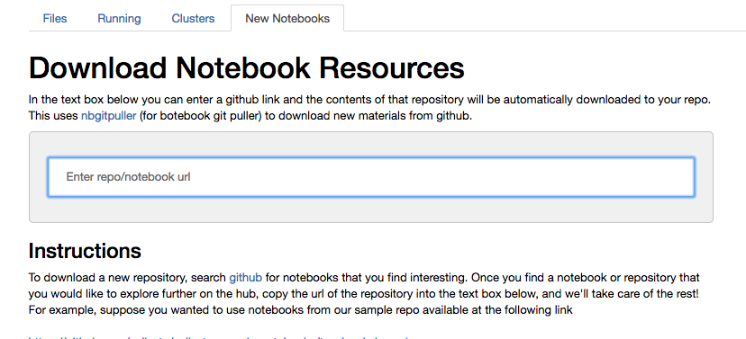

# Wrapper For NBGitpuller

>
> This image shows an example of the tab this extension adds to your hub environment.

This notebook extension (though maybe not _technically_ a notebook extension) adds an extra tab to your hub environment where in you can copy-paste github urls directly and let [`nbgitpuller`](https://github.com/jupyterhub/nbgitpuller) clone the repo into your repository.

## Installation

To install this extension follow the instructions below

1. run `pip install git+https://github.com/callysto/gitpuller-wrapper --user` 
2. Restart your server 

You should now have a tab called "Github Notebooks" in your repo
**Note:** You may need to allow pop-ups from the site as it will open the git-puller stuff in a new tab. 
## Alternatively
1. From any directory, clone this repository
2. Enter `/gitpuller_wrapper`. 
3. Run `python setup.py install --user`
    - Note that this also activates and installs the jupyter extensions for you
    - Also note that you may have to explicitly type `python3` if you have other versions installed
4. Restart your server
5. You should now have a tab called "Github Notebooks" in your repo
**Note:** You may need to allow pop-ups from the site as it will open the git-puller stuff in a new tab. 

## Usage

Simply copy paste github links directly into the url box of the extension. Then, a new tab will open with the familiar `nbgitpuller` animations as the repository is cloned.

## Notes/Known issues
1. This only works with github repository links. If you enter any url that isn't github, or doesn't look like a github repository, this doesn't do anything (and javascript alerts will complain).
2. Deeply nested directories with the same name as a branch tend to confuse the git parser. You may have trouble cloning a specific branch if the repository has naming conventions where the branch name is the same as some directories.

## Third Party Software
1. This uses a [browserifyed](http://browserify.org/) version of a github url parser available [here](https://github.com/jonschlinkert/parse-github-url)
